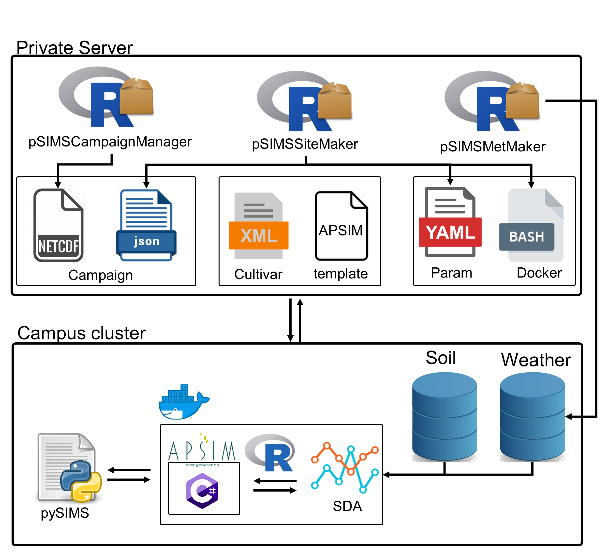

In this tutorial, I will be using `pSIMSSiteMaker` and `pSIMCampaignManager` packages to first create a ncdf campaign file and then use the newly created campaign file to create a whole pSIMS simulation for a specific site.



Before using these packages, I need to mention that `pSIMCampaignManager` depends on two packages of `JBTools` and `ncdf.tools` which both are unfortunately off the CRAN, however you can the following link to find the latests version : [Link to packages](https://github.com/AgronomicForecastingLab/pSIMS_Campaign_Manager/tree/master/inst)  and manually install them.

```{r setup, include=FALSE}
options(warn=-1)
knitr::opts_chunk$set(echo = TRUE)
knitr::opts_chunk$set(message = FALSE)
unlink(list.files(".",".nc"))
message(.libPaths())
```
<style>
 table{
    border: 1px solid black; padding:10px;

    width: 75% !important;;
    }
</style>


```{r}
library(pSIMSSiteMaker)
library(pSIMCampaignManager)
```

### What area Campaign and Param files?

The parameter file
==================
The parameter file is a YAML-formatted file containing all the parameters of a psims
run. It defines things like the number of simulation years, the path to climate input files,
and which model to use. Below is a list of parameters and a description of what it does.

Parameter      | Description
---------      |------------
aggregator     | Aggregator options, used to average a variable across a region
checker        | Checker translator and options, check if a tile should be simulated or not
delta          | Simulation delta, gridcell spacing in arcminutes
executable     | Name of executable and arguments to run for each grid
lat\_zero      | Top edge of the North most grid cell in the campaign
lon\_zero      | Left edge of the West most grid cell in the campaign
long\_names    | Long names for variables, in same order that variables are listed
model          | Defines the type of model to run. Valid options are dssat45, dssat46, apsim75
num\_lats      | Number of latitudes to be included in final nc4 file (starting with lat\_zero)
num\_lons      | Number of longitudes to be included in final nc4 file (starting with lon\_zero)
num\_years     | Number of years to simulate
out\_file      | Defines the prefix of the final nc4 filename
outtypes       | File extensions of files to include in output tar file
refdata        | Directory containing reference data. Will be copied to each simulation
ref\_year      | Reference year (the first year of the simulation)
scens          | Number of scenarios in the campaign
soils          | Directory containing soils
tappcmp        | Campaign translator and options
tappinp        | Input translator and options, goes from experiment.json and soil.json to model specific files
tapptilewth    | Weather tile translator and options
tapptilesoil   | Soil tile translator and options
tappnooutput   | The "no output" translator and options, typically used to create empty data
tappwth        | Weather translator and options, converts .psims.nc format into model specfic weather files
tdelta         | Tile delta gridcell spacing in arcminutes
postprocess    | Name of translator and options to run after running executable
var\_units     | Units to use for each variable, in the same order that variables are listed
variables      | Define the variables to extract to final outputs
weather        | Defines the directory where weather data is stored

Campaign Files
==============
When pysims is run, the user must specify a campaign directory with the --campaign parameter. Typically this campaign directory contains two relevant files named Campaign.nc4 and exp_template.json. These files are used by the jsons2dssat and jsons2apsim translators to create experiment files for the crop model.

The exp_template.json file contains key-value pairs for data that will be written to the experiment file. These values represent things like fertilizer amounts, irrigation settings, and planting dates. Static settings for the experiment are stored in exp_template.json. Values that vary by lat, lon, scenario, or time get stored in Campaign.nc4.

Here is an example of irrigation definitions in exp_template.json.

```{json echo=FALSE}
  "dssat_simulation_control": {
    "data": [
        "irrigation": {
          "ithru": "100",
          "iroff": "GS000",
          "imeth": "IR001",
          "imdep": "40",
          "ireff": "1.0",
          "iramt": "10",
          "ithrl": "80"
        },...

```

But users may not want to these irrigation settings everywhere. If they have a collection of irrigation amounts (iramt) that change by location, users may create a variable in Campaign.nc4 called iramt. The most basic version of this would be a NetCDF variable in the format of float iramt(lat, lon). When pysims runs for a given point, the appropriate value would transfer from Campaign.nc4 into the experiment file. If iramt is not defined in Campaign.nc4, the static value from exp_template.json is used instead.

There may be situations where users want to have multiple irrigation amounts defined in your exp_template.json. In this case having an iramt variable in Campaign.nc4 variable is ambiguous because you're not sure which irrigation amount it corresponds to. In these cases pysims uses a numbering system in the Campaign.nc4 variable names. The variable iramt_1 corresponds to the first instance of iramt in exp_template.json. iramt_2 corresponds to the second instance, and so on. This process works the same for all variables, not just limited to iramt.


**For more information please read the README page on the [Github pSIMS page](https://github.com/RDCEP/psims)**
 
### Creating an Empty Campign file


```{r message=FALSE}
Create_Empty_Campaign(lat=c(44,45), lon=c(-91,-92), num_scen=3, filename = "MyCampaign.nc4")
```

For some basic inspection purposes, we can use the `Get_Camp_dim` to explore the number of dimensions in your campaign file.

```{r message=FALSE}
Get_Camp_dim("MyCampaign.nc4")
```


Another handy function named `Campaign_emptyMatrix` also creates a series of matrices (as many as the number of scenarios) that could be used for inserting into our Campaign file. In the code below this  `Get_Camp_dim("MyCampaign.nc4")$Count` helps to find the number of values that needs to be generated for each scenario.


```{r message=FALSE}
Campaign_emptyMatrix("MyCampaign.nc4",
                      runif(Get_Camp_dim("MyCampaign.nc4")$Count, 100,2500)
)
```

---

###  Add variables to our Campagin file


Campaign variables can be classified into three categories: 1) Variables with numeric values such as initial soil moisture or residue weight 2) Categorical variables such as hybrid names for different cultivates, name of the met files and 3) Variables with date values such planting date or harvesting date 


####  Add variables with numeric values: 

```{r message=FALSE}
#generate new values for your new variable
num_scen <- Get_Camp_dim("MyCampaign.nc4")$Scen

new.values <- purrr::map(seq_along(num_scen), ~Campaign_emptyMatrix("MyCampaign.nc4",
                                                    runif(Get_Camp_dim("MyCampaign.nc4")$Count, 100,2500)
)[[1]])

print(new.values)
```

Now add the created values to the campaign file :

```{r message=FALSE}
AddVar_Campaign("MyCampaign.nc4",
                Variable = list(Name='icrag',
                                Unit='Kg', 
                                longname = "", 
                                prec = "float",
                                missingValue=-99,
                                value= new.values
                ),
                attr = list('long_name',"Residue weight")
)

```

We can then check if the variable was corectly added by using the following functions:

```{r message=FALSE}

GetCamp_VarMatrix("MyCampaign.nc4", 'icrag')


plot(GetCamp_VarMatrix("MyCampaign.nc4", 'icrag')$Raster)

```

####  Add variables with categorical values: 
pSIMS uses the `long_name` attribute to store a list of categorical variables, and then uses the indices specified as the value for that variable to map the indices to the categorical values.  

We can use `copy_variable` function to create a new variable based on an exiting variable in our campaign file. Then using the `Edit_mapping_var` we set the `long_name` attribute to a list of desired categorical values. In the below example we use the `file` variable to ensemble the met files in apsim simulations where 'met00000.met,met00001.met...' refers to the name of the met files. Lastly, we create random indices (values should be as many as we have categorical values and 10 the example below)

```{r message=FALSE}
# How many value I need to produce . lat * lon = count * number of scenarios
Countv <- Get_Camp_dim("MyCampaign.nc4")$Count * max(Get_Camp_dim("MyCampaign.nc4")$Scen)

copy_variable("MyCampaign.nc4", varname='file', fromname='icrag')

Edit_mapping_var ("MyCampaign.nc4", var='file' , attr='long_name', value='met00000.met,met00001.met,met00002.met,met00003.met,met00004.met,met00005.met,met00006.met,met00007.met,met00008.met,met00009.met')

set_scenario_val ("MyCampaign.nc4", 'file', sample(1:10, Countv, TRUE))
```


These variables could be also created as follow using `AddVar_Campaign` function. 1) We create a series of indices between 1-14 allowing psims to map the indices to the categorical values specified in the "long-name".  2) Add those values as a new variable here called `cultivar` and 3) edit the long name by speicifying the list of your cultivar names.

```{r message=FALSE}
new.values <- purrr::map(1:50,~Campaign_emptyMatrix("MyCampaign.nc4",
                                                    sample(c(1:14), Get_Camp_dim("MyCampaign.nc4")$Count,TRUE)
)[[1]])


AddVar_Campaign("MyCampaign.nc4",
                Variable = list(Name='cultivar',
                                Unit='Mapping',
                                missingValue=-99,
                                longname = "", 
                                prec = "float",
                                value= new.values
                ),
                attr = list('long_name',"Nebraska_3.1,Nebraska_3.2,Nebraska_3.3,Nebraska_3.4,HiSoy2846_2.8,Pioneer93M42_3.4,Pioneer91B01_1.0,Pioneer_92M61_2.6,Becks_321NRR_3.2,Becks_367NRR_3.7,Krucr_2.7,Elgin_2.7,K283_2.0,Wayne_3.0")
)


```

We can also always inspect the campaign file to check if the variables are in the right format using below functions:

```{r message=FALSE}
Inspect_Camp("MyCampaign.nc4")

GetCamp_VarMatrix("MyCampaign.nc4", 'file')$Matrix
```
So in the above output, these values are indices that will be mapped to the list of categorical values in the long_name.

---

### Modify existing Campign files

####  Increase the number of  scenarios

You can also increase the number of scenarios using the code below

```{r message=FALSE}
#push the scenario dimension to how many we need
Add_Scenario("MyCampaign.nc4", 3)
```


####  Copy values between scenarios

if we decide to increase the number of scenarios, this means that the added new scenarios will not have any values, therefore we can use the below function to copy values from one scenario to others. Then we will be able to modify new copied values later on.

```{r message=FALSE}
copy_scanarios("MyCampaign.nc4", varname='icrag', fromScenario=1, toScenarios=c(4:6))
```

####  Remove a variable

We can also remove a variable from our Campign nc file using the following function:

```{r eval=FALSE, include=TRUE}
remove_var_campaign("MyCampaign.nc4", outfile="Campaign2.nc4", varnames=c('file'))
```


####  Edit values for a given variable

If you're also interested to edit a specifc value in your campaign, you may use the following function:

```{r}

Inspect_Camp("MyCampaign.nc4")

EditVar_Campaign("MyCampaign.nc4", 'icrag',
                 vals=list(lat=c(44),
                           lon=c(-91),
                           scenario=c(1),
                           Value=c(200)
                           )
                 )
```
To check if the edit worked :

```{r}


GetCamp_VarMatrix("MyCampaign.nc4", 'icrag')$Matrix

```

####  Edit mapping variables

You can also edit variables with `Mapping` property using the following function:

```{r}

Edit_mapping_var ("MyCampaign.nc4", 'file' , 'long_name', 'met00000.met,met00001.met,met00001.met,met00001.met,met00001.met,met00001.met,met00001.met,met00001.met,met00001.met,met00001.met')

```


####  Add Uncertainty

Finally if we're planning to ensemblize a variable, we can create a variable first, then increase the number of scenarios and finally add uncertainty to the newly added scenarios. Adding the uncertainty could be done using the following function:


```{r}
Add_Uncertainty_scenarios("MyCampaign.nc4", "icrag", sd=5, scenario=1, toscenario=2:3)

```

This function takes the data in the `scenario` argument and uses that as a mean and generates new values given the `sd` arguments and applies to the other scenarios provided in `toscenario` argument. 


---


### Creating a full pSIMS simulation
This package relies on a series of pSIMS file templates for `params`, `campaign.json`, `campaign.nc`, `template.apsim` and in case user needs to use a cusotmized version of these files, they either need to be modified using the provided tools in this package or the path to those files need to be provided.


`pSIMS_Site_Make` allows for modifying Param file and Campagin.json using two different methods:

1) User can edit these two files by providing a list of items that need to be changed in these files using `camp_list` and `param_list ` argumnet like the example below for `camp_list`. In this example, user asks to change the planting depth to `35` and the rest of the variables will be set using the defult values. Defualt values can be seen and checked using `Read_Campaign_template()` and `Read_param_template()`. `Read_Campaign_template()` and `Read_param_template()` reads those templates as R lists and each element in the list can be accessed and modified using usual R commands.

2) The second approach start with reading the templates as it was mentioned before and user can directly change any of the values. Then the modified obj need to be passed to the `pSIMS_Site_Make` function using `Param_template_Obj` and `Campaign_json_Obj` arguments. Below we show an example of this method for `Param_template_Obj`. We can use this link for finding the right delta : https://www.nhc.noaa.gov/gccalc.shtml

`pSIMS_Site_Make` uses the lat/lon provided as arguments and maps them to the pSIMS girdding system. Then using the information provided in the `Bash_control` argument, it creates a bash script for running pSIMS inside a singularity container. 

`Campaign_Path`: Allows for providing your own customized ncdf campagin file similar to what we created above.

`APSIM_Template_Path` Allows for providing your custom APSIM template

`Bash_control`

```{r eval=FALSE, include=TRUE}
tmp_param <- Read_param_template()
tmp_param$model <- "apsim79"


pSIMS_Site_Make(dirname = ".",
                Project_name = "Site123",
                Lat=40.04,
                Lon = -88.5,
                host=NULL,
                Param_template_Obj=tmp_param,
                camp_list=list(planting=list(depth="35")),
                Campaign_Path = "MyCampaign.nc4",
                APSIM_Template_Path = NULL,
                Bash_control=list(pSIMS_Data_Path="/pysims/data", # No need to edit this
                                  pSIMS_server_Path="/projects/aces/hamzed/psims/Data",
                pSIMS_Sing_Image="/projects/aces/mkivi2/psims/Bash/apsim_psims_image/custom_psims_full.img")
                )
)

```


This function create a new directory in the `dirname` named `Project_name` with all the required files and it will be ready to be run either localy or to me moved to the campus cluster.

***Attention*** should be paid to the type of variables when we're editing editing param file and campaign.json. If you're planning to change for example `ref_year` in the  param file the following code would result writing back a string year (which will break pSIMS):

```{r}
tmp_param <- Read_param_template()
tmp_param$ref_year <- 2018

```

The correct way of adding numerical integer values is like below:

```{r}
tmp_param <- Read_param_template()
tmp_param$ref_year <- 2018L

```

####  Moving pSIMS simulation between different servers: 

Create a ssh tunnel using the following command to transfer your files between your local machine and the campus cluster :

```{bash eval=FALSE, include=TRUE}
ssh -n -N -f -o ControlMaster=yes -S ~/tunnel/tunnel  UIUC_NETID@cc-login.campuscluster.illinois.edu
```

`~/tunnel/tunnel` is the path where the tunnel will be saved and will be used. The only difference between the `pSIMS_Site_Make` call above and below is the `host` argument which includes the name of the cluster, username, path to the tunnel (explained earlier) and the path to the simulation that will be created (this depends on the `dirname` and `Project_name` arguments) and finally where it needs to be transferred to. 

***Attention*** should be paid to where the simulations are being moved to. If there is a ny directory with the same name, the conetent of that dir will be removed and replaced with newly created simulations.

```{r eval=FALSE, include=TRUE}
host <-
  list(name = 'cc-login.campuscluster.illinois.edu',
       user = 'hamzed',
       tunnel = '~/tunnel/tunnel',
       from='/home/hamzed/pSIMS/Site123',
       to='/projects/aces/hamzed/psims/Data/')


pSIMS_Site_Make(dirname = ".",
                Project_name = "Site123",
                Lat=40.04,
                Lon = -88.5,
                Param_template_Obj=tmp_param,
                camp_list=list(planting=list(depth="35")),
                host=host,
                Bash_control=list(pSIMS_Data_Path="/pysims/data", # No need to edit this
                                  pSIMS_server_Path="/projects/aces/hamzed/psims/Data",
                pSIMS_Sing_Image="/projects/aces/mkivi2/psims/Bash/apsim_psims_image/custom_psims_full.img")
                )
```


After running your simulations you can also transfer back the results to your local machine using the following function:

```{r eval=FALSE, include=TRUE}

remote.copy.from(host=host,
                 src='/projects/aces/hamzed/psims/Data/EF',
                 dst=file.path(getwd(),"EF_results"),
                 delete = TRUE)
```

where `src` is where the simulation is located on the campus cluster and `dst` is where you want to save the results. 

A full end to end test of the `pSIMS_Site_Make` can be found in the `tests` directory inside the package
